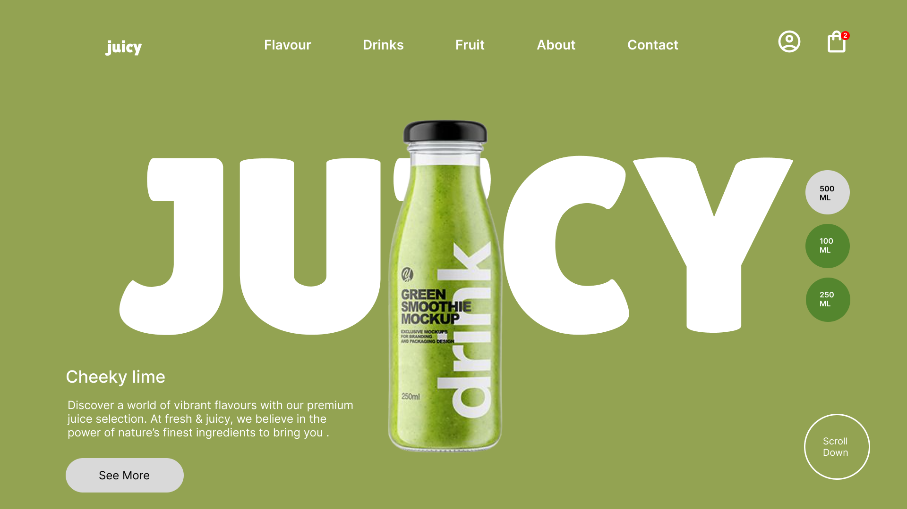
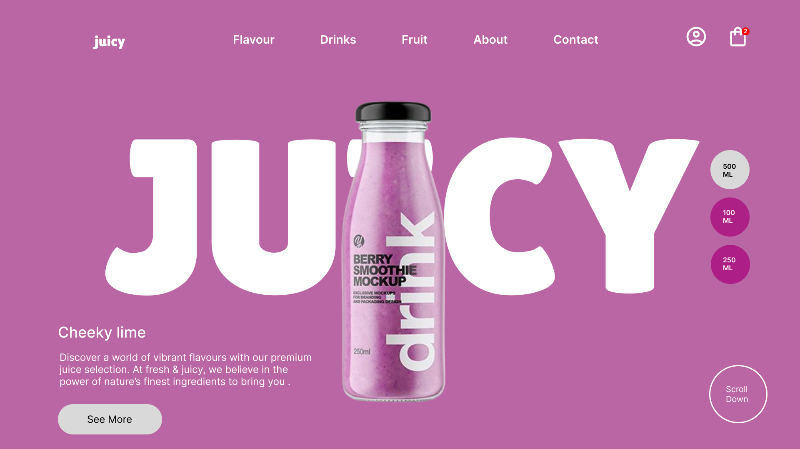
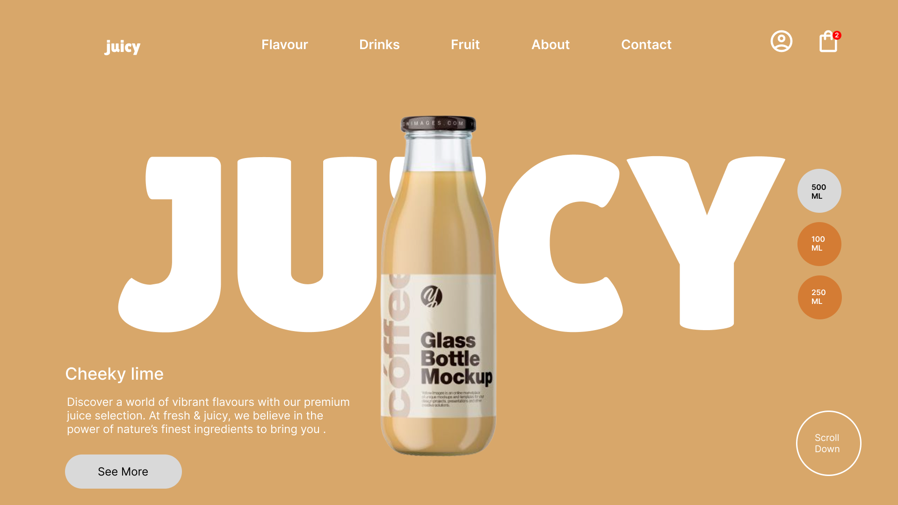
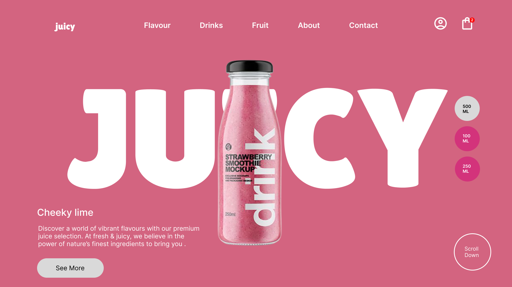

# 🍹 JUICY UI Design

A modern and colorful UI concept for a **Juice Brand Website**, designed in **Figma**.  
This project explores multiple color variants and clean minimal layouts.  

---

## 🔗 Figma File
[👉 View on Figma](https://www.figma.com/design/HomQbir6m5fQhcTCbeCd5N/web-copy-?node-id=71-7&t=9ECtErX5lFgdooZr-1)  

---

## 🎨 Design Variants

### 🟩 Green

### 🟪 Purple

### 🟫 Coffee

### 🩷 Pink

---

## 📂 Project Info
- **Tool Used**: Figma  
- **Focus**: Minimal UI, Branding, Web Layouts  
- **Features**: Color theme variations, Hero section, Product highlights  

---

✨ *If you like this design, don’t forget to ⭐ the repo!*  
